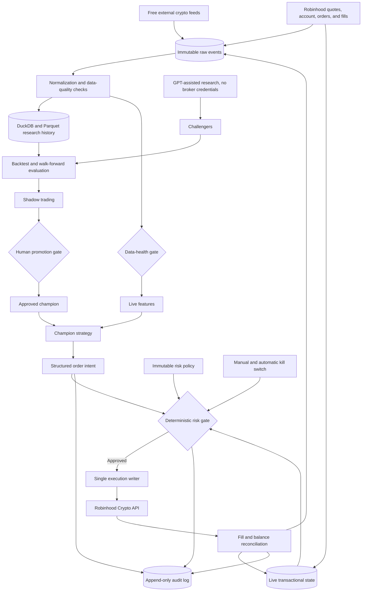

# Crypto bot architecture

The system is a modular monolith: one deployable application with hard module
boundaries. That keeps operation simple while preventing strategy, research,
and execution responsibilities from becoming entangled.

## Module boundaries

- **Data:** adapters, normalized events, timestamp alignment, and health checks.
- **Strategy:** pure decision logic that returns an order intent.
- **Risk:** deterministic policy that returns an approval or rejection.
- **Execution:** the only module allowed to hold broker credentials or place an
  order.
- **Research:** backtests, challengers, evaluations, and promotion evidence.
- **Monitoring:** audit records, alerts, reconciliation, and kill-switch state.

## Initial data bottlenecks

- Robinhood execution prices can differ from external exchange prices.
- Free feeds have outages, rate limits, symbol differences, and uneven history.
- A candle does not reveal the exact spread or fill available at decision time.
- Backtests need point-in-time fees, latency, spread, and rejected-order models.
- Local collection must run long enough to build trustworthy execution-aware
  history.

The live loop must fail closed: stale, missing, or materially conflicting data
blocks new orders rather than asking the strategy to guess.
